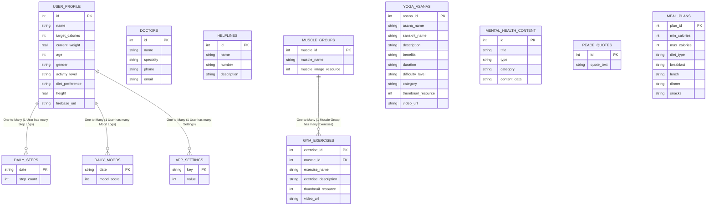

## Legend
- **PK**: Primary Key
- **FK**: Foreign Key
- **||--o{**: **One-to-Many** Relationship (The double bar `||` is the "One" side, the crow's foot `o{` is the "Many" side)
- **||--||**: **One-to-One** Relationship
