# Yugved4 Database - Entity Relationship Diagram (ERD)

## Overview
This document represents the complete database schema for the Yugved4 Health & Fitness Android Application.

---

## Entity Relationship Diagram (Mermaid)

```mermaid
erDiagram
    %% ========== USER MANAGEMENT ==========
    USER_PROFILE {
        int id PK "Primary Key, Auto-increment"
        string name "User's name"
        int target_calories "Daily calorie goal"
        real current_weight "Weight in kg"
        int age "User's age"
        string gender "Male/Female"
        string activity_level "Sedentary/Active/etc"
        string diet_preference "Veg/Non-Veg"
        real height "Height in cm"
        string firebase_uid "Firebase User ID"
    }

    %% ========== DOCTOR MANAGEMENT ==========
    DOCTORS {
        int id PK "Primary Key, Auto-increment"
        string name "Doctor's name"
        string specialty "Medical specialty"
        string phone "Contact number"
        string email "Email address (optional)"
    }

    %% ========== MENTAL HEALTH ==========
    MENTAL_HEALTH_CONTENT {
        int id PK "Primary Key, Auto-increment"
        string title "Content title"
        string type "Video/Tip"
        string category "Meditation/Stress/Sleep"
        string content_data "Link or Description"
    }

    HELPLINES {
        int id PK "Primary Key, Auto-increment"
        string name "Organization name"
        string number "Phone number"
        string description "Service description"
    }

    PEACE_QUOTES {
        int id PK "Primary Key, Auto-increment"
        string quote_text "Motivational quote"
    }

    DAILY_MOODS {
        string date PK "Date (yyyy-MM-dd)"
        int mood_score "Score 1-5"
    }

    %% ========== GYM WORKOUTS ==========
    MUSCLE_GROUPS {
        int muscle_id PK "Primary Key, Auto-increment"
        string muscle_name "Chest/Back/Legs/etc"
        int muscle_image_resource "Android resource ID"
    }

    GYM_EXERCISES {
        int exercise_id PK "Primary Key, Auto-increment"
        int muscle_id FK "Foreign Key to MUSCLE_GROUPS"
        string exercise_name "Exercise name"
        string exercise_description "How to perform"
        int thumbnail_resource "Android resource ID"
        string video_url "Video file path"
    }

    %% ========== YOGA ==========
    YOGA_ASANAS {
        int asana_id PK "Primary Key, Auto-increment"
        string asana_name "English name"
        string sanskrit_name "Sanskrit name"
        string description "How to perform"
        string benefits "Comma-separated benefits"
        string duration "Recommended time"
        string difficulty_level "Beginner/Intermediate/Advanced"
        string category "Type of yoga"
        int thumbnail_resource "Android resource ID"
        string video_url "Video file path"
    }

    %% ========== DIET & NUTRITION ==========
    MEAL_PLANS {
        int plan_id PK "Primary Key, Auto-increment"
        int min_calories "Minimum calorie range"
        int max_calories "Maximum calorie range"
        string diet_type "Veg/Non-Veg"
        string breakfast "Breakfast meal details"
        string lunch "Lunch meal details"
        string dinner "Dinner meal details"
        string snacks "Snack details"
    }

    %% ========== STEP TRACKING ==========
    DAILY_STEPS {
        string date PK "Date (yyyy-MM-dd)"
        int step_count "Number of steps"
    }

    WEEKLY_ACTIVITY {
        int id PK "Primary Key, Auto-increment"
        string date "Activity date"
        string activity_type "brisk_walking/running/cycling"
        int duration_minutes "Duration in minutes"
    }

    %% ========== APP CONFIGURATION ==========
    APP_SETTINGS {
        string key PK "Setting key"
        int value "Setting value"
    }

    %% ========== RELATIONSHIPS ==========
    MUSCLE_GROUPS ||--o{ GYM_EXERCISES : "contains"
    USER_PROFILE ||--o{ DAILY_STEPS : "tracks"
    USER_PROFILE ||--o{ DAILY_MOODS : "logs"
    USER_PROFILE ||--o{ WEEKLY_ACTIVITY : "performs"
    USER_PROFILE }o--|| MEAL_PLANS : "follows"
```



---

## Table Descriptions & Relationships

### 1. USER_PROFILE
| Column | Type | Constraints | Description |
|--------|------|-------------|-------------|
| id | INTEGER | PK, AUTO_INCREMENT | Unique identifier |
| name | TEXT | - | User's display name |
| target_calories | INTEGER | NOT NULL | Daily calorie target |
| current_weight | REAL | NOT NULL | Current weight in kg |
| age | INTEGER | - | User's age |
| gender | TEXT | - | Male/Female |
| activity_level | TEXT | - | Activity classification |
| diet_preference | TEXT | - | Vegetarian/Non-Vegetarian |
| height | REAL | - | Height in cm |
| firebase_uid | TEXT | - | Firebase authentication ID |

**Relationships:**
- One user → Many daily steps (1:N)
- One user → Many daily moods (1:N)
- One user → Many weekly activities (1:N)
- One user → One meal plan (based on calorie range) (N:1)

---

### 2. DOCTORS
| Column | Type | Constraints | Description |
|--------|------|-------------|-------------|
| id | INTEGER | PK, AUTO_INCREMENT | Unique identifier |
| name | TEXT | NOT NULL | Doctor's full name |
| specialty | TEXT | NOT NULL | Medical specialty |
| phone | TEXT | NOT NULL | Contact phone number |
| email | TEXT | - | Email address (optional) |

**Relationships:** Standalone entity (synced to Firebase Firestore)

---

### 3. MUSCLE_GROUPS
| Column | Type | Constraints | Description |
|--------|------|-------------|-------------|
| muscle_id | INTEGER | PK, AUTO_INCREMENT | Unique identifier |
| muscle_name | TEXT | NOT NULL | Name (Chest, Back, etc.) |
| muscle_image_resource | INTEGER | NOT NULL | Drawable resource ID |

**Relationships:**
- One muscle group → Many gym exercises (1:N) **[FOREIGN KEY]**

---

### 4. GYM_EXERCISES
| Column | Type | Constraints | Description |
|--------|------|-------------|-------------|
| exercise_id | INTEGER | PK, AUTO_INCREMENT | Unique identifier |
| muscle_id | INTEGER | FK, NOT NULL | References MUSCLE_GROUPS |
| exercise_name | TEXT | NOT NULL | Exercise name |
| exercise_description | TEXT | NOT NULL | Instructions |
| thumbnail_resource | INTEGER | NOT NULL | Drawable resource ID |
| video_url | TEXT | - | Video file path |

**Relationships:**
- Many exercises → One muscle group (N:1) **[FOREIGN KEY CONSTRAINT]**

---

### 5. YOGA_ASANAS
| Column | Type | Constraints | Description |
|--------|------|-------------|-------------|
| asana_id | INTEGER | PK, AUTO_INCREMENT | Unique identifier |
| asana_name | TEXT | NOT NULL | English name |
| sanskrit_name | TEXT | NOT NULL | Sanskrit name |
| description | TEXT | NOT NULL | How to perform |
| benefits | TEXT | NOT NULL | Comma-separated list |
| duration | TEXT | NOT NULL | Recommended duration |
| difficulty_level | TEXT | NOT NULL | Difficulty level |
| category | TEXT | NOT NULL | Yoga type |
| thumbnail_resource | INTEGER | NOT NULL | Drawable resource ID |
| video_url | TEXT | - | Video file path |

**Relationships:** Standalone entity (reference data)

---

### 6. MEAL_PLANS
| Column | Type | Constraints | Description |
|--------|------|-------------|-------------|
| plan_id | INTEGER | PK, AUTO_INCREMENT | Unique identifier |
| min_calories | INTEGER | NOT NULL | Minimum calorie range |
| max_calories | INTEGER | NOT NULL | Maximum calorie range |
| diet_type | TEXT | NOT NULL | Veg/Non-Veg |
| breakfast | TEXT | NOT NULL | Breakfast details |
| lunch | TEXT | NOT NULL | Lunch details |
| dinner | TEXT | NOT NULL | Dinner details |
| snacks | TEXT | NOT NULL | Snack details |

**Relationships:**
- Referenced by USER_PROFILE (based on target_calories and diet_preference)

---

### 7. MENTAL_HEALTH_CONTENT
| Column | Type | Constraints | Description |
|--------|------|-------------|-------------|
| id | INTEGER | PK, AUTO_INCREMENT | Unique identifier |
| title | TEXT | NOT NULL | Content title |
| type | TEXT | NOT NULL | Video/Tip |
| category | TEXT | NOT NULL | Meditation/Stress/Sleep |
| content_data | TEXT | NOT NULL | URL or description |

**Relationships:** Standalone entity (reference data)

---

### 8. HELPLINES
| Column | Type | Constraints | Description |
|--------|------|-------------|-------------|
| id | INTEGER | PK, AUTO_INCREMENT | Unique identifier |
| name | TEXT | NOT NULL | Organization name |
| number | TEXT | NOT NULL | Phone number |
| description | TEXT | NOT NULL | Description |

**Relationships:** Standalone entity (reference data)

---

### 9. DAILY_STEPS
| Column | Type | Constraints | Description |
|--------|------|-------------|-------------|
| date | TEXT | PK | Date in yyyy-MM-dd format |
| step_count | INTEGER | NOT NULL | Total steps for the day |

**Relationships:**
- Associated with USER_PROFILE (implicit 1:N)

---

### 10. DAILY_MOODS
| Column | Type | Constraints | Description |
|--------|------|-------------|-------------|
| date | TEXT | PK | Date in yyyy-MM-dd format |
| mood_score | INTEGER | NOT NULL | Score from 1-5 |

**Relationships:**
- Associated with USER_PROFILE (implicit 1:N)

---

### 11. WEEKLY_ACTIVITY
| Column | Type | Constraints | Description |
|--------|------|-------------|-------------|
| id | INTEGER | PK, AUTO_INCREMENT | Unique identifier |
| date | TEXT | NOT NULL | Activity date |
| activity_type | TEXT | NOT NULL | brisk_walking/running/cycling |
| duration_minutes | INTEGER | NOT NULL | Duration in minutes |

**Relationships:**
- Associated with USER_PROFILE (implicit 1:N)

---

### 12. PEACE_QUOTES
| Column | Type | Constraints | Description |
|--------|------|-------------|-------------|
| id | INTEGER | PK, AUTO_INCREMENT | Unique identifier |
| quote_text | TEXT | NOT NULL | Motivational quote |

**Relationships:** Standalone entity (reference data)

---

### 13. APP_SETTINGS
| Column | Type | Constraints | Description |
|--------|------|-------------|-------------|
| key | TEXT | PK | Setting key |
| value | INTEGER | NOT NULL | Setting value |

**Relationships:** Standalone entity (configuration data)

---

## Cardinality Summary

| Relationship | Cardinality | Description |
|--------------|-------------|-------------|
| MUSCLE_GROUPS → GYM_EXERCISES | 1:N | One muscle group contains many exercises |
| USER_PROFILE → DAILY_STEPS | 1:N | One user has many daily step records |
| USER_PROFILE → DAILY_MOODS | 1:N | One user has many mood entries |
| USER_PROFILE → WEEKLY_ACTIVITY | 1:N | One user has many activity records |
| USER_PROFILE → MEAL_PLANS | N:1 | Many users may follow same meal plan |

---

## Database Schema Notes

1. **Primary Database**: SQLite (local storage on Android device)
2. **Cloud Sync**: Firebase Firestore for DOCTORS and USER_PROFILE tables
3. **Database Version**: 18
4. **Database Name**: `yugved.db`

### Foreign Key Constraint
```sql
FOREIGN KEY(muscle_id) REFERENCES muscle_groups(muscle_id)
```
This is the only explicit foreign key constraint in the database, linking gym exercises to their corresponding muscle groups.

---

## Visual ERD Summary

```
┌─────────────────────────────────────────────────────────────────────────────────┐
│                           YUGVED4 DATABASE SCHEMA                                │
├─────────────────────────────────────────────────────────────────────────────────┤
│                                                                                  │
│   ┌──────────────────┐         ┌──────────────────┐                            │
│   │   USER_PROFILE   │────────→│   DAILY_STEPS    │  (1:N)                     │
│   │   ────────────   │         └──────────────────┘                            │
│   │   id (PK)        │         ┌──────────────────┐                            │
│   │   name           │────────→│   DAILY_MOODS    │  (1:N)                     │
│   │   target_calories│         └──────────────────┘                            │
│   │   current_weight │         ┌──────────────────┐                            │
│   │   age, gender    │────────→│ WEEKLY_ACTIVITY  │  (1:N)                     │
│   │   activity_level │         └──────────────────┘                            │
│   │   diet_preference│──┐                                                       │
│   │   height         │  │      ┌──────────────────┐                            │
│   │   firebase_uid   │  └─────→│    MEAL_PLANS    │  (N:1)                     │
│   └──────────────────┘         └──────────────────┘                            │
│                                                                                  │
│   ┌──────────────────┐         ┌──────────────────┐                            │
│   │  MUSCLE_GROUPS   │────────→│   GYM_EXERCISES  │  (1:N)                     │
│   │   ────────────   │   FK    │   ────────────   │                            │
│   │   muscle_id (PK) │◄────────│   muscle_id (FK) │                            │
│   │   muscle_name    │         │   exercise_id(PK)│                            │
│   │   image_resource │         │   name, desc     │                            │
│   └──────────────────┘         │   video_url      │                            │
│                                └──────────────────┘                            │
│                                                                                  │
│   ┌──────────────────┐   ┌──────────────────┐   ┌──────────────────┐          │
│   │   YOGA_ASANAS    │   │     DOCTORS      │   │   APP_SETTINGS   │          │
│   │   ────────────   │   │   ────────────   │   │   ────────────   │          │
│   │   asana_id (PK)  │   │   id (PK)        │   │   key (PK)       │          │
│   │   asana_name     │   │   name           │   │   value          │          │
│   │   sanskrit_name  │   │   specialty      │   └──────────────────┘          │
│   │   description    │   │   phone          │                                  │
│   │   benefits       │   │   email          │   ┌──────────────────┐          │
│   │   duration       │   └──────────────────┘   │   PEACE_QUOTES   │          │
│   │   difficulty     │                          │   ────────────   │          │
│   │   category       │   ┌──────────────────┐   │   id (PK)        │          │
│   │   thumbnail      │   │ MENTAL_HEALTH    │   │   quote_text     │          │
│   │   video_url      │   │ CONTENT          │   └──────────────────┘          │
│   └──────────────────┘   │   ────────────   │                                  │
│                          │   id (PK)        │   ┌──────────────────┐          │
│                          │   title          │   │    HELPLINES     │          │
│                          │   type           │   │   ────────────   │          │
│                          │   category       │   │   id (PK)        │          │
│                          │   content_data   │   │   name           │          │
│                          └──────────────────┘   │   number         │          │
│                                                 │   description    │          │
│                                                 └──────────────────┘          │
│                                                                                  │
└─────────────────────────────────────────────────────────────────────────────────┘
```

---

*Generated on: 2026-02-02*
*Application: Yugved4 Health & Fitness App*
